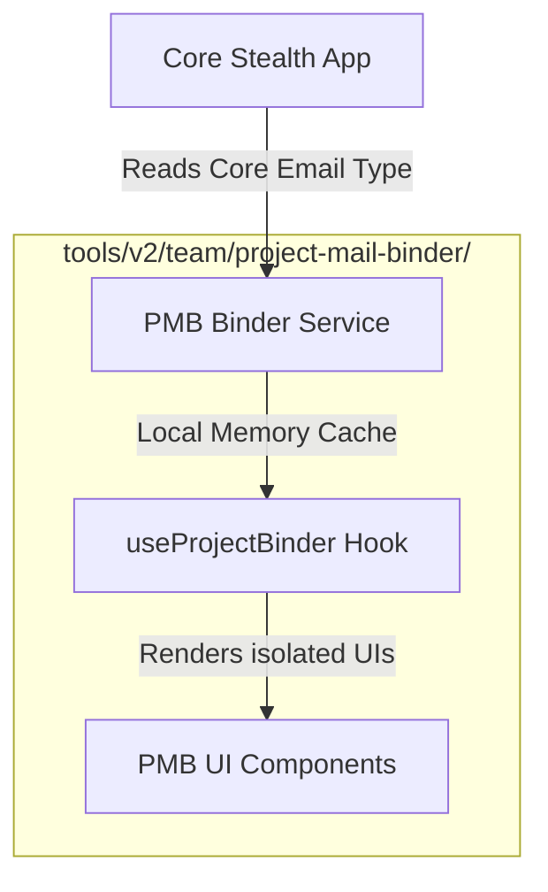

# Project Mail Binder - Architecture Specifications

This document outlines the design architecture, module boundaries, Stellar integration paths, security bounds, and complexity analysis for **Project Mail Binder (PMB)**.

---

## 🧭 Architecture Boundaries

PMB is designed to run entirely as an **isolated sub-product**. It holds strict data separation:

### 1. Data Isolation Policy

- Core database files (`src/server/` or DB layers) **must not** store PMB mappings in V2.
- PMB features rely on **folder-local caches** or localized index files.
- The main inbox UI (`EmailList.tsx`, `Sidebar.tsx`) must never reference PMB components directly. Instead, integration should occur via pluggable interfaces (like dynamic action-bars or context-menus) defined by future tickets.

---

## ⛓️ Stellar & Soroban Integrations

PMB coordinates with the Stellar network to bind transactions and emails automatically.

### 1. Stellar Memos

When team tasks or invoices are settled on-chain, transaction metadata links back to the binder:

- **`MEMO_ID` (64-bit uint)**: Used to represent a unique project index number. The autobinder parses incoming receipt logs matching this index directly.
- **`MEMO_HASH` (32-byte hex string)**: Holds the SHA-256 hash of the email body or project document. PMB service verifies the hash integrity on-chain through the Soroban receipts client.

### 2. Stellar Federation

- A project can register a human-readable alias like `alpha-project*stealth.network`.
- Resolving this address returns the project’s Stellar public key (`G...`), ensuring seamless payment routing.

---

## 🔒 Security & Privacy Bounds

- **Data Leakage Prevention**: Since emails are encrypted end-to-end, PMB matching rules are evaluated _post-decryption_ inside the client workspace only. Unlocked email contents are never transmitted to external APIs or unauthenticated relays.
- **Rule Verification**: Pattern matches compile with boundary checks and sanitization to prevent RegExp injection vulnerabilities.

---

## ⏱️ Computational Invariants

### Auto-Binding Lookup Time Complexity

To avoid performance bottlenecks on massive mail archives (e.g. 10,000+ threads), the matcher splits rules:

- **Set Lookup (Sender matching)**: $\mathcal{O}(1)$ query time per email.
- **Trie / Compiled RegExp (Text searching)**: $\mathcal{O}(L \cdot R)$ where $L$ is the string length and $R$ is active regex rules. Redundant passes are eliminated.

### Space Complexity

- Mappings map keys to sets: $\mathcal{O}(B)$ memory overhead where $B$ is the number of active bindings.
